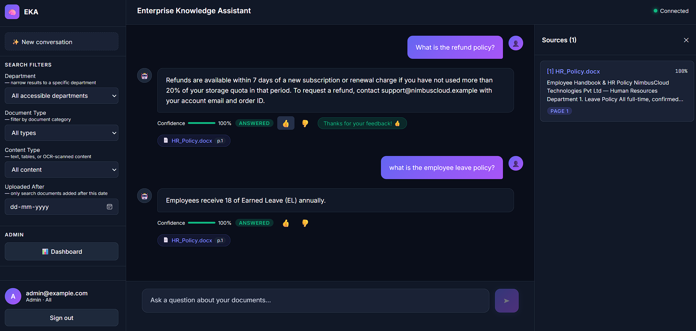
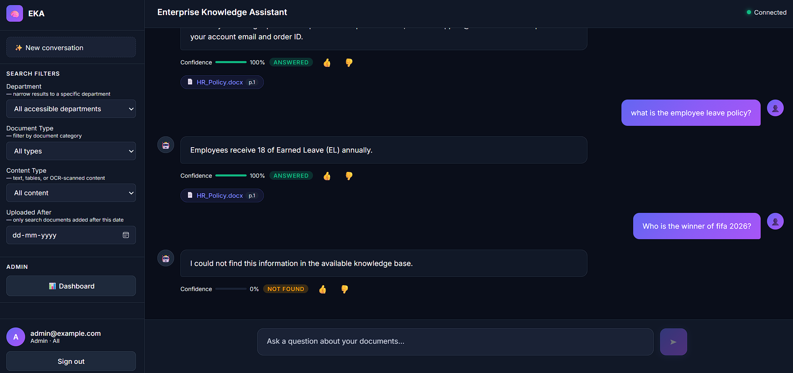
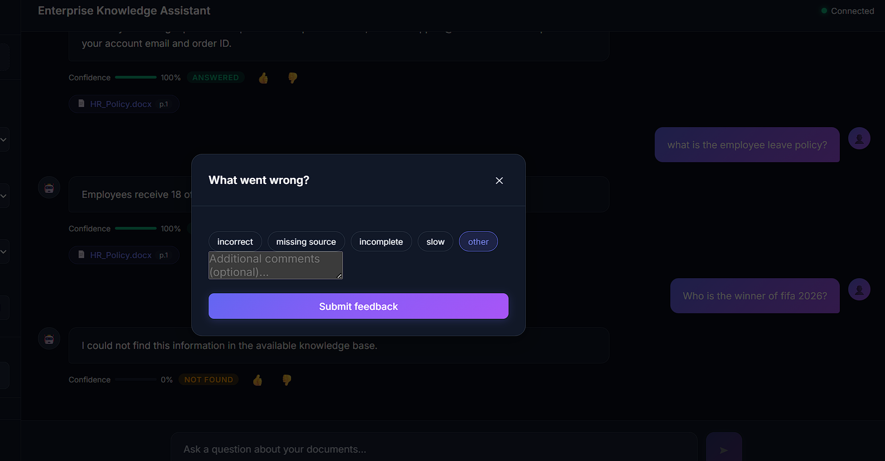
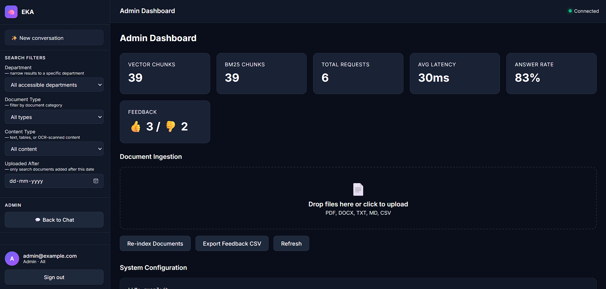

# 🤖 Enterprise Knowledge Assistant (EKA) – Enterprise-Grade Local RAG System 🧠

**Enterprise Knowledge Assistant (EKA)** is a production-oriented **Retrieval-Augmented Generation (RAG)** system designed to run entirely locally and offline for absolute data privacy and security. EKA allows employees to ask natural-language questions over a company's internal document library (PDFs, DOCX, TXT, MD, CSV) and receive accurate, context-grounded answers with page-level citations, explainability traces, and real-time streaming responses.

<p align="center">
  
  
  
  
  
  
  
</p>

---

## 📚 Table of Contents

- [🏢 Overview](#-enterprise-knowledge-assistant-eka--enterprise-grade-local-rag-system-)
- [🚀 Features](#-features)
- [🏗️ System Architecture & Diagram](#️-system-architecture--diagram)
- [⚙️ How It Works (RAG Pipeline)](#️-how-it-works-rag-pipeline)
- [🛠️ Technical Decisions & Design Choices](#️-technical-decisions--design-choices)
- [📸 Demo Screenshots](#-demo-screenshots)
- [🎥 Demo Video](#-demo-video)
- [🔬 Evaluation Approach](#-evaluation-approach)
- [⚙️ Setup Instructions & Running the App](#️-setup-instructions--running-the-app)
  - [Prerequisites](#prerequisites)
  - [Installation](#installation)
  - [Configure Environment](#configure-environment)
  - [Running the Application](#running-the-application)
- [👥 Demo Users](#-demo-users)
- [🔒 API Quick Reference](#-api-quick-reference)
- [⚠️ Known Limitations](#️-known-limitations)
- [🔮 Future Improvements](#-future-improvements)
- [📄 License](#-license)
- [📬 Contact](#-contact)

---

## 🚀 Features

### 📂 Layout-Aware Document Ingestion
- Upload and process **PDF, DOCX, TXT, MD, and CSV** documents.
- Uses layout-aware text extraction (`pdfplumber`) to preserve reading flow, headers, and tabular grids.
- Automatically handles scanned image-only pages using **Tesseract OCR** when page word counts fall below the baseline threshold.
- Separates tables using dedicated parsers and stores them as distinct structured markdown chunks (`content_type=table`).

### 🔍 Dense-Sparse Hybrid Search
- Combines semantic vector search (`BAAI/bge-small-en-v1.5` embeddings) with lexical keyword matching (`BM25`).
- Merges results using **Reciprocal Rank Fusion (RRF)** for optimal recall.
- Applies an optional **Cross-Encoder Reranker** to boost answer precision.

### 🛡️ Hallucination & Out-of-Scope Query Prevention
- Implements a relevance confidence floor (`NO_ANSWER_THRESHOLD=0.20`).
- If no retrieved context matches the query above this score, the assistant gracefully replies: *"I could not find this information in the available knowledge base"* instead of hallucinating.

### 🔑 Enterprise Security & Role-Based Access (RBAC)
- Full JWT authentication with password hashing.
- Filters document retrieval dynamically based on user department properties and document access level metadata tags (e.g. `admin`, `hr`, `employee`).

### ⚡ Real-Time Answer Streaming (SSE)
- Emits answers token-by-token over Server-Sent Events (SSE) `/ask/stream` for an interactive, low-latency chatbot interface.

### 📈 Metrics Dashboard & Admin Controls
- Upload documents directly via the UI drag-and-drop zone.
- View real-time statistics (Ingested chunks, Avg Latency, Answer Rate, User Feedback thumbs ratios).
- Access complete explainability traces showing exactly what questions were asked, retrieval latency, and final RAG statuses.
- Export employee feedback to CSV.

---

## 🏗️ System Architecture & Diagram

The high-level layout of the EKA platform consists of a React client communicating with a FastAPI microservice, backed by a hybrid local storage system:

```text
┌─────────────────────────────────────────────────────────────────────┐
│                        React Frontend (SPA)                         │
│              Ask · Upload Docs · Source Preview · Admin             │
└────────────────────────────┬────────────────────────────────────────┘
                             │ HTTP / SSE
┌────────────────────────────▼────────────────────────────────────────┐
│                   FastAPI Backend  (app/api/)                       │
│  /auth  /ask  /ask/stream  /ingest  /sources  /feedback  /admin     │
│              JWT Auth · Role-Based Access · Error Handlers          │
└──────┬─────────────────────────────────────────────────┬────────────┘
       │ RAG Pipeline                                    │ Admin / Ops
┌──────▼──────────────────┐                  ┌───────────▼─────────────┐
│   Query Processing      │                  │  Observability / Admin  │
│  • Query rewrite (LLM)  │                  │  • Dashboard metrics    │
│  • Hybrid retrieval     │                  │  • Retrieval trace logs │
│    – Semantic (ChromaDB)│                  │  • Feedback export CSV  │
│    – Keyword (BM25)     │                  │  • Cache management     │
│  • RRF fusion           │                  └─────────────────────────┘
│  • Cross-encoder rerank │
│  • Answer generation    │
│    (Ollama / local LLM) │
│  • Source citation      │
└──────┬──────────────────┘
       │
┌──────▼──────────────────────────────────────────────────────────────┐
│                         Data Layer                                  │
│  ChromaDB (vector store) │ BM25 (keyword index) │ SQLite (metadata) │
└─────────────────────────────────────────────────────────────────────┘
```

---

## ⚙️ How It Works (RAG Pipeline)

EKA coordinates a structured, hybrid pipeline for document processing and real-time retrieval:

```text
┌────────────────────────┐       ┌────────────────────────┐
│   Ingest Documents     ├──────►│  Extract Layout/Tables ├──────┐
└────────────────────────┘       └────────────────────────┘      │
                                                                 ▼
┌────────────────────────┐       ┌────────────────────────┐  ┌───┴────────────────────┐
│   ChromaDB (Vector)    │◄──────┤   Generate Embeddings  │◄─┤ Chunking & Metadata    │
│   + In-Memory BM25     │       └────────────────────────┘  └────────────────────────┘
└──────────┬─────────────┘
           │
           ▼ User Query
┌──────────┴─────────────┐       ┌────────────────────────┐
│  Hybrid Search & RRF   ├──────►│ Optional Cross-Encoder ├──────┐
└────────────────────────┘       └────────────────────────┘      │
                                                                 ▼
┌────────────────────────┐       ┌────────────────────────┐  ┌───┴────────────────────┐
│  Confidence Score Check├──────►│ Ollama LLM Generation  ├─►│ SSE Answer Streaming   │
│  (Threshold Guardrail) │       │ (with citations)       │  └────────────────────────┘
└────────────────────────┘       └────────────────────────┘
```

1. **Document Loading & Extraction:** Ingested documents are parsed using `pdfplumber` to extract text and tables while maintaining visual margins. Scanned pages trigger OCR.
2. **Chunking & Indexing:** Chunks are created, tagged with metadata, and converted to embeddings which are saved into ChromaDB. The lexical BM25 index is updated in parallel.
3. **Retrieval & Reranking:** Queries trigger parallel vector and BM25 lookups. Results are fused using RRF and reranked using a Cross-Encoder.
4. **Answer Generation:** Grounded context is sent to the local `qwen3` model, which streams structured citations and answers via Server-Sent Events (SSE).

---

## 🛠️ Technical Decisions & Design Choices

The EKA system is built to minimize infrastructure costs and maximize security by running the entire pipeline locally. Below are the core technical choices and justifications:

### 1. Document Processing Decisions

* **Document Loading & Text Extraction:**
  * *Choice:* `pdfplumber` as primary, `pypdf` as fallback, and `Tesseract OCR` for scanned sheets.
  * *Reasoning:* `pdfplumber` offers superior layout-aware extraction compared to naive text readers, preserving tables and reading order. Scanned pages are automatically identified when text densities fall below a limit, keeping documents searchable without heavy external pre-processing.
* **Chunking Strategy:**
  * *Choice:* `RecursiveCharacterTextSplitter` (Size: 512 tokens, Overlap: 64 tokens) + Table segmentation.
  * *Reasoning:* Standard token lengths fit within the embedding model's context window. An overlap of 64 tokens ensures that paragraphs spanning across boundaries retain semantic continuity. Tables are extracted separately as raw markdown text so structural data remains queryable.
* **Metadata Management:**
  * *Choice:* Structured JSON attributes stored alongside vector entries.
  * *Reasoning:* Storing document names, page numbers, upload timestamps, department codes, and `access_roles` directly in ChromaDB allows us to enforce Role-Based Access Control (RBAC) in-database before presenting results to the LLM.
* **Embedding Generation:**
  * *Choice:* `BAAI/bge-small-en-v1.5` running on CPU via Sentence Transformers.
  * *Reasoning:* Generates high-quality 384-dimensional dense vectors with low latency on CPUs, avoiding GPU resource overheads.
* **Searchable Index Storage:**
  * *Choice:* ChromaDB (vector index) + BM25 (lexical index).
  * *Reasoning:* Vector storage alone can miss technical names, IDs, or policy numbers. Having a secondary BM25 index ensures exact lexical lookups are handled successfully, and fusion is handled via Reciprocal Rank Fusion (RRF).

### 2. Large Language Models (LLM) — Ollama
* *Choice:* Local `qwen3:4b` (Primary) and `qwen3:1.7b` (Fallback).
* *Reasoning:* Running models locally via Ollama keeps data strictly within company boundaries and eliminates external API token costs. `qwen3:4b` offers an exceptional speed-to-quality ratio for natural language understanding and structured citation generation.

### 3. Frameworks & Backend Design
* *Choice:* FastAPI + React/Vite.
* *Reasoning:* FastAPI's support for asynchronous endpoints makes Server-Sent Events (SSE) easy to implement, enabling real-time streaming answers. React ensures a responsive sidebar document filter and an interactive citation interface.

---

## 📸 Demo Screenshots

### 🔑 Secure Login
A secure entry point with seeded demo credentials to test role-based access levels.


### 💬 Chat Interface (Home)
An interactive chat dashboard equipped with advanced sidebar search filters (Department, Document Type, Content Type, Date).


### 🔍 Citation & Source Drawer
Answers are grounded in local files, linking directly to the document source name and page number, with an interactive side drawer highlighting the exact text snippet.


### 🛡️ Out-of-Scope Query Handling
Prevents hallucinations by indicating when a question cannot be resolved using the ingested document directory.


### 📝 User Feedback & Dialog Box
Employees can provide instant quality feedback (thumbs up/down) with specific labels (incorrect, incomplete, slow, missing source) to log and track answer quality.


### 📊 Admin Operations Dashboard
A central command center monitoring total request count, average RAG pipeline latency, success ratios, user feedback ratings, and direct UI document ingestion.


### ⚙️ System Configuration & Retrieval Traces
Administrators can inspect active models, top-k parameters, and audit the complete history of questions alongside detailed latency metrics.


---

## 🎥 Demo Video

📺 Click below to **watch/download the full Enterprise Knowledge Assistant walk-through**:

➡️ [View Full Demo Video](assets/demo/eka_demo_video.mp4)

---

## 🔬 Evaluation Approach

### 1. Performance Metrics
EKA continuously monitors system health and RAG effectiveness using:
* **Answerability Ratio:** The percentage of user queries that receive an `ANSWERED` status vs. `NOT_FOUND` (relevance floor guards).
* **End-to-End Latency:** Segmented latency tracking for retrieval, reranking, and generation.
* **User Feedback Ratio:** Aggregated thumbs up/down feedback ratios logged in SQLite.

### 2. Test Cases
The system was evaluated against a diverse test suite containing:
* **Direct Lookup:** Testing basic document facts (e.g., *"What is the employee leave policy?"*).
* **Multi-Document Reasoning:** Questions requiring synthesising rules from multiple pages (e.g., combining leave rules and remote work guidelines).
* **Out-of-Scope Requests:** General world knowledge queries (e.g., *"Who won the 2026 World Cup?"*) to verify the threshold guardrail triggers `NOT_FOUND`.
* **Ambiguous Inputs:** Verifying query-rewriting behavior on conversational follow-ups (e.g., *"Tell me more about it"*).
* **RBAC Controls:** Attempting to retrieve HR guidelines while logged in as a general employee.

### 3. RAG Improvements Implemented
* **BM25 + Semantic Hybrid Search:** Resolved failures where pure semantic search missed precise policy identifiers.
* **RRF Rank Fusion:** Combined vector and keyword indices without score-scaling issues.
* **No-Answer Threshold:** Configured at `0.20` to suppress hallucinations.
* **Session Query Rewriting:** Rewrites multi-turn inputs using conversational context.

---

## ⚙️ Setup Instructions & Running the App

### Prerequisites
* **Python:** 3.10 or 3.11
* **Node.js:** 18+ (for frontend dev server)
* **Ollama Runtime:** Download from [Ollama.ai](https://ollama.com)
* **Tesseract OCR:** (Optional, for scanned PDFs)

### Installation

1. **Clone the Repository:**
   ```bash
   git clone https://github.com/DhanushKrishna07/enterprise_knowledge_assistant.git
   cd enterprise_knowledge_assistant
   ```

2. **Set up Virtual Environment:**
   ```bash
   python -m venv .venv
   
   # Windows Activation
   .venv\Scripts\activate
   
   # macOS / Linux Activation
   source .venv/bin/activate
   ```

3. **Install Dependencies:**
   ```bash
   pip install -e ".[dev]"
   npm install
   cd frontend && npm install && cd ..
   ```

4. **Pull Local LLM Models:**
   Ensure Ollama is running, then execute:
   ```bash
   ollama pull qwen3:4b
   ollama pull qwen3:1.7b
   ```

5. **Initialize Databases & Seed Users:**
   ```bash
   python scripts/seed_users.py
   ```

### Configure Environment

Create a `.env` file in the project root:
```dotenv
OLLAMA_BASE_URL=http://localhost:11434
LLM_MODEL=qwen3:4b
LLM_FALLBACK_MODEL=qwen3:1.7b
EMBEDDING_MODEL=BAAI/bge-small-en-v1.5
DOCUMENTS_PATH=data/documents
CHROMA_PATH=data/index/chroma
SQLITE_URL=sqlite:///data/app.db
JWT_SECRET=change-me-before-production-deployment
NO_ANSWER_THRESHOLD=0.20
```

### Running the Application

Start the backend API and frontend dev server concurrently:
```bash
npm run dev
```
Open **[http://localhost:5173/](http://localhost:5173/)** in your browser.

---

## 👥 Demo Users

The database is seeded with three default testing roles:

| **Email**              | **Password** | **Role**   | **Access / Department Scope**             |
|------------------------|--------------|------------|-------------------------------------------|
| `admin@example.com`    | `admin123`   | `admin`    | Full system access + Ingestion panel      |
| `employee@example.com` | `employee123`| `employee` | General documents only                    |
| `hr@example.com`       | `hr123`      | `employee` | General documents + HR policy documents   |

---

## 🔒 API Quick Reference

| **Method** | **Endpoint**                 | **Auth** | **Description**                              |
|------------|------------------------------|----------|----------------------------------------------|
| `POST`     | `/auth/login`                | None     | Authenticate user & generate JWT             |
| `GET`      | `/auth/me`                   | Bearer   | Get details of authenticated user            |
| `POST`     | `/ask`                       | Bearer   | Direct RAG question response                 |
| `POST`     | `/ask/stream`                | Bearer   | Stream RAG answer (SSE tokens)               |
| `POST`     | `/ingest`                    | Admin    | Ingest a single file upload                  |
| `POST`     | `/ingest/directory`          | Admin    | Index all documents in a directory           |
| `GET`      | `/admin/dashboard`           | Admin    | Retrieve vector, feedback & latency metrics  |
| `GET`      | `/admin/retrieval-stats`     | Admin    | View pipeline trace logs                     |
| `GET`      | `/admin/feedback/export`     | Admin    | Export evaluation feedback to CSV            |

---

## ⚠️ Known Limitations

* **Ollama Dependency:** Requires a running local Ollama instance; no automated cloud fallback.
* **CPU Latency:** High ingestion times for large text directories when running embedding/reranking on standard CPUs.
* **In-Memory BM25:** The lexical search index is loaded into memory on backend startup; large libraries can increase cold-start times.
* **Volatile Session Memory:** Conversational histories are stored in-process and reset when the backend process restarts.

---

## 🔮 Future Improvements

* **Persistent History:** Relocate user chat sessions to a persistent database (SQLite or Redis).
* **GPU Hardware Acceleration:** Native device detection for embedded embedding libraries.
* **RAGAS Evaluation Integration:** Continuous automated RAG evaluation workflows.
* **Incremental Ingestion Sync:** Ingest files dynamically by scanning checksum changes rather than re-indexing.
* **Single Sign-On (SSO):** Integrate LDAP or SAML authentication.

---

## 📄 License

Distributed under the **MIT License**. See `LICENSE` for more information.

---

## 📧 Contact

📨 **Email:** dhanushkrishnab@gmail.com  
🔗 **LinkedIn:** https://www.linkedin.com/in/dhanushkrishna15
